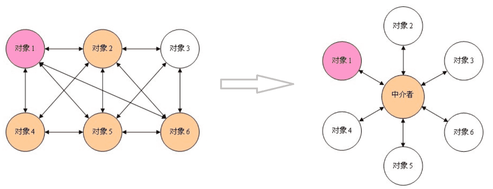
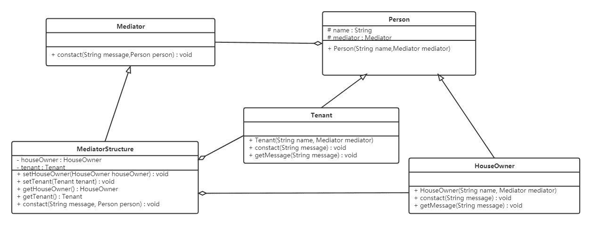

# 中介者模式

## 概述

一般来说，同事类之间的关系是比较复杂的，多个同事类之间互相关联时，他们之间的关系会呈现为复杂的网状结构，这是一种过度耦合的架构，即不利于类的复用，也不稳定。例如在下左图中，有六个同事类对象，假如对象1发生变化，那么将会有4个对象受到影响。如果对象2发生变化，那么将会有5个对象受到影响。也就是说，同事类之间直接关联的设计是不好的。

如果引入中介者模式，那么同事类之间的关系将变为星型结构，从下右图中可以看到，任何一个类的变动，只会影响的类本身，以及中介者，这样就减小了系统的耦合。一个好的设计，必定不会把所有的对象关系处理逻辑封装在本类中，而是使用一个专门的类来管理那些不属于自己的行为。



**定义：**

又叫调停模式，定义一个中介角色来封装一系列对象之间的交互，使原有对象之间的耦合松散，且可以独立地改变它们之间的交互。


## 结构

中介者模式包含以下主要角色：

* 抽象中介者（Mediator）角色：它是中介者的接口，提供了同事对象注册与转发同事对象信息的抽象方法。

* 具体中介者（ConcreteMediator）角色：实现中介者接口，定义一个 List 来管理同事对象，协调各个同事角色之间的交互关系，因此它依赖于同事角色。
* 抽象同事类（Colleague）角色：定义同事类的接口，保存中介者对象，提供同事对象交互的抽象方法，实现所有相互影响的同事类的公共功能。
* 具体同事类（Concrete Colleague）角色：是抽象同事类的实现者，当需要与其他同事对象交互时，由中介者对象负责后续的交互。


## 案例实现

【例】租房

现在租房基本都是通过房屋中介，房主将房屋托管给房屋中介，而租房者从房屋中介获取房屋信息。房屋中介充当租房者与房屋所有者之间的中介者。

类图如下：



代码如下：

```java
//抽象中介者
public abstract class Mediator {
    //申明一个联络方法
    public abstract void constact(String message,Person person);
}

//抽象同事类
public abstract class Person {
    protected String name;
    protected Mediator mediator;

    public Person(String name,Mediator mediator){
        this.name = name;
        this.mediator = mediator;
    }
}

//具体同事类 房屋拥有者
public class HouseOwner extends Person {

    public HouseOwner(String name, Mediator mediator) {
        super(name, mediator);
    }

    //与中介者联系
    public void constact(String message){
        mediator.constact(message, this);
    }

    //获取信息
    public void getMessage(String message){
        System.out.println("房主" + name +"获取到的信息：" + message);
    }
}

//具体同事类 承租人
public class Tenant extends Person {
    public Tenant(String name, Mediator mediator) {
        super(name, mediator);
    }

    //与中介者联系
    public void constact(String message){
        mediator.constact(message, this);
    }

    //获取信息
    public void getMessage(String message){
        System.out.println("租房者" + name +"获取到的信息：" + message);
    }
}

//中介机构
public class MediatorStructure extends Mediator {
    //首先中介结构必须知道所有房主和租房者的信息
    private HouseOwner houseOwner;
    private Tenant tenant;

    public HouseOwner getHouseOwner() {
        return houseOwner;
    }

    public void setHouseOwner(HouseOwner houseOwner) {
        this.houseOwner = houseOwner;
    }

    public Tenant getTenant() {
        return tenant;
    }

    public void setTenant(Tenant tenant) {
        this.tenant = tenant;
    }

    public void constact(String message, Person person) {
        if (person == houseOwner) {          //如果是房主，则租房者获得信息
            tenant.getMessage(message);
        } else {       //反正则是房主获得信息
            houseOwner.getMessage(message);
        }
    }
}

//测试类
public class Client {
    public static void main(String[] args) {
        //一个房主、一个租房者、一个中介机构
        MediatorStructure mediator = new MediatorStructure();

        //房主和租房者只需要知道中介机构即可
        HouseOwner houseOwner = new HouseOwner("张三", mediator);
        Tenant tenant = new Tenant("李四", mediator);

        //中介结构要知道房主和租房者
        mediator.setHouseOwner(houseOwner);
        mediator.setTenant(tenant);

        tenant.constact("需要租三室的房子");
        houseOwner.constact("我这有三室的房子，你需要租吗？");
    }
}
```


## 优缺点

**1，优点：**

* 松散耦合

  中介者模式通过把多个同事对象之间的交互封装到中介者对象里面，从而使得同事对象之间松散耦合，基本上可以做到互补依赖。这样一来，同事对象就可以独立地变化和复用，而不再像以前那样“牵一处而动全身”了。

* 集中控制交互

  多个同事对象的交互，被封装在中介者对象里面集中管理，使得这些交互行为发生变化的时候，只需要修改中介者对象就可以了，当然如果是已经做好的系统，那么就扩展中介者对象，而各个同事类不需要做修改。

* 一对多关联转变为一对一的关联

  没有使用中介者模式的时候，同事对象之间的关系通常是一对多的，引入中介者对象以后，中介者对象和同事对象的关系通常变成双向的一对一，这会让对象的关系更容易理解和实现。

**2，缺点：**

当同事类太多时，中介者的职责将很大，它会变得复杂而庞大，以至于系统难以维护。


## 使用场景

* 系统中对象之间存在复杂的引用关系，系统结构混乱且难以理解。
* 当想创建一个运行于多个类之间的对象，又不想生成新的子类时。

